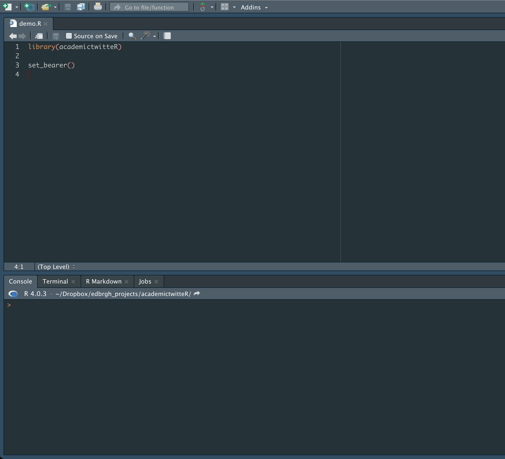

# academictwitteR 

<!-- badges: start -->
[](https://developer.twitter.com/en/docs/twitter-api)
[](https://doi.org/10.21105/joss.03272) 
[](https://cran.r-project.org/package=academictwitteR)

[](https://cran.r-project.org/package=academictwitteR)
[]( https://app.codecov.io/gh/cjbarrie/academictwitteR?branch=master)
<!-- badges: end -->


[](https://twitter.com/cbarrie)
[](https://twitter.com/justin_ct_ho)

Repo containing code to for R package <tt>academictwitteR</tt> to collect tweets from v2 API endpoint for the Academic Research Product Track.

To cite package ‘academictwitteR’ in publications use:

  - Barrie, Christopher and Ho, Justin Chun-ting. (2021). academictwitteR: an R package to access the Twitter Academic Research Product Track v2 API endpoint. *Journal of Open Source Software*, 6(62), 3272, https://doi.org/10.21105/joss.03272

A BibTeX entry for LaTeX users is:

```
@article{BarrieHo2021,
  doi = {10.21105/joss.03272},
  url = {https://doi.org/10.21105/joss.03272},
  year = {2021},
  publisher = {The Open Journal},
  volume = {6},
  number = {62},
  pages = {3272},
  author = {Christopher Barrie and Justin Chun-ting Ho},
  title = {academictwitteR: an R package to access the Twitter Academic Research Product Track v2 API endpoint},
  journal = {Journal of Open Source Software}
}

  
```

## Installation

You can install the package with:
``` r
install.packages("academictwitteR")
```

Alternatively, you can install the development version with:
``` r
devtools::install_github("cjbarrie/academictwitteR", build_vignettes = TRUE)
```

Get started by reading `vignette("academictwitteR-intro")`.

To use the package, it first needs to be loaded with:

```r

library(academictwitteR)

```

The <tt>academictwitteR</tt> package has been designed with the efficient storage of data in mind. Queries to the API include arguments to specify whether tweets be stored as a .rds file using the `file` argument or as separate JSON files for tweet- and user-level information separately with argument `data_path`.

Tweets are returned as a data.frame object and, when a `file` argument has been included, will also be saved as a .rds file.

When collecting large amounts of data, we recommend the workflow described below, which allows the user : 1) to efficiently store authorization credentials; 2) to efficiently store returned data; 3) bind the data into a data.frame object or tibble ;4) resume collection in case of interruption; and 5) update collection in case of need.

## Authorization

The first task is set authorization credentials with the `set_bearer()` function, which allows the user to store their bearer token in the .Renviron file.

To do so, use:

```r
set_bearer()
```

and enter authorization credentials as below:



This will mean that the bearer token is automatically called during API calls. It also avoids the inadvisable practice of hard-coding authorization credentials into scripts. 

See the vignette documentation `vignette("academictwitteR-auth")` for further information on obtaining a bearer token.

## Collection

The workhorse function is `get_all_tweets()`, which is able to collect tweets matching a specific search query or all tweets by a specific set of users.

```r

tweets <-
  get_all_tweets(
    query = "#BlackLivesMatter",
    start_tweets = "2020-01-01T00:00:00Z",
    end_tweets = "2020-01-05T00:00:00Z",
    file = "blmtweets",
    data_path = "data/",
    n = 1000000,
  )
  
```

Here, we are collecting tweets containing a hashtag related to the Black Lives Matter movement over the period January 1, 2020 to January 5, 2020. 

We have also set an upper limit of one million tweets. When collecting large amounts of Twitter data we recommend including a `data_path` and setting `bind_tweets = FALSE` such that data is stored as JSON files and can be bound at a later stage upon completion of the API query.

```r

tweets <-
  get_all_tweets(
    users = c("jack", "cbarrie"),
    start_tweets = "2020-01-01T00:00:00Z",
    end_tweets = "2020-01-05T00:00:00Z",
    file = "blmtweets",
    n = 1000
  )
  
```

Whereas here we are not specifying a search query and instead are requesting all tweets by users @jack and @cbarrie over the period January 1, 2020 to January 5, 2020. Here, we set an upper limit of 1000 tweets.

The search query and user query arguments can be combined in a single API call as so:

```r

get_all_tweets(
  query = "twitter",
  users = c("cbarrie", "jack"),
  start_tweets = "2020-01-01T00:00:00Z",
  end_tweets = "2020-05-01T00:00:00Z",
  n = 1000
)

```

Where here we would be collecting tweets by users @jack and @cbarrie over the period January 1, 2020 to January 5, 2020 containing the word "twitter."

```r

get_all_tweets(
  query = c("twitter", "social"),
  users = c("cbarrie", "jack"),
  start_tweets = "2020-01-01T00:00:00Z",
  end_tweets = "2020-05-01T00:00:00Z",
  n = 1000
)

```

While here we are collecting tweets by users @jack and @cbarrie over the period January 1, 2020 to January 5, 2020 containing the words "twitter" or "social."

Note that the "AND" operator is implicit when specifying more than one character string in the query. See [here](https://developer.twitter.com/en/docs/twitter-api/tweets/search/integrate/build-a-query) for information on building queries for search tweets. Thus, when searching for all elements of a character string, a call may look like:

```r

get_all_tweets(
  query = c("twitter social"),
  users = c("cbarrie", "jack"),
  start_tweets = "2020-01-01T00:00:00Z",
  end_tweets = "2020-05-01T00:00:00Z",
  n = 1000
)

```

, which will capture tweets containing *both* the words "twitter" and "social." The same logics apply for hashtag queries.

Whereas if we specify our query as separate elements of a character vector like this:

```r

get_all_tweets(
  query = c("twitter", "social"),
  users = c("cbarrie", "jack"),
  start_tweets = "2020-01-01T00:00:00Z",
  end_tweets = "2020-05-01T00:00:00Z",
  n = 1000
)

```
, this will be capturing tweets by users @cbarrie or @jack containing the words "twitter" *or* social. 

Finally, we may wish to query an exact phrase. To do so, we can either input the phrase in escape quotes, e.g., `query ="\"Black Lives Matter\""` or we can use the optional parameter `exact_phrase = T` (in devt. version) to search for tweets containing the exact phrase string:

```r

tweets <-
  get_all_tweets(
    query = "Black Lives Matter",
    exact_phrase = T,
    start_tweets = "2021-01-04T00:00:00Z",
    end_tweets = "2021-01-04T00:45:00Z",
    n = Inf
  )

```

See the vignette documentation `vignette("academictwitteR-build")` for further information on building more complex API calls.

## Data storage

Files are stores as JSON files in specified directory when a `data_path` is specified. Tweet-level data is stored in files beginning "data_"; user-level data is stored in files beginning "users_".

If a filename is supplied, the functions will save the resulting tweet-level information as a .rds file.

Functions always return a data.frame object unless a `data_path` is specified and `bind_tweets` is set to `FALSE`. When collecting large amounts of data, we recommend using the `data_path` option with `bind_tweets = FALSE`. This mitigates potential data loss in case the query is interrupted. 

See the vignette documentation `vignette("academictwitteR-intro")` for further information on data storage conventions.

## Reformatting

Users can then use the `bind_tweets` convenience function to bundle the JSONs into a data.frame object for analysis in R as such:

```r
tweets <- bind_tweets(data_path = "data/")
users <- bind_tweets(data_path = "data/", user = TRUE)
```

To bind JSONs into tidy format, users can also specify a tidy output format. 

```r
bind_tweets(data_path = "tweetdata", output_format = "tidy")
```

See the vignette documentation `vignette("academictwitteR-tidy")` for further information on alternative output formats.

## Interruption and Continuation

The package offers two functions to deal with interruption and continue previous data collection session. If you have set a data_path and export_query was set to "TRUE" during the original collection, you can use `resume_collection()` to resume a previous interrupted collection session. An example would be:

```r
resume_collection(data_path = "data")
```

If a previous data collection session is completed, you can use `update_collection()` to continue data collection with a new end date. This function is particularly useful for getting data for ongoing events. An example would be:

```r
update_collection(data_path = "data", end_tweets = "2020-05-10T00:00:00Z")
```

## Note on v2 Twitter API

For more information on the parameters and fields available from the v2 Twitter API endpoint see: [https://developer.twitter.com/en/docs/twitter-api/tweets/search/api-reference/get-tweets-search-all](https://developer.twitter.com/en/docs/twitter-api/tweets/search/api-reference/get-tweets-search-all).

## Arguments

`get_all_tweets()` accepts a range of arguments, which can be combined to generate a more precise query.

| Arguments   |     Description      |
|----------|:-------------:|
|query | Search query or queries e.g. "cat"
|exact_phrase | If `TRUE`, only tweets will be returned matching the exact phrase
|users | string or character vector, user handles to collect tweets from the specified users
|reply_to | string or character vector, user handles to collect replies to the specified users
|retweets_of| string or character vector, user handles to collects retweets of tweets by the specified users
|exclude | string or character vector, tweets containing the keyword(s) will be excluded
|is_retweet | If `TRUE`, only retweets will be returned; if `FALSE`, retweets will not be returned, only tweets will be returned; if `NULL`, both retweets and tweets will be returned.
|is_reply | If `TRUE`, only reply tweets will be returned
|is_quote | If `TRUE`, only quote tweets will be returned
|is_verified |If `TRUE`, only tweets whose authors are verified by Twitter will be returned
|remove_promoted | If `TRUE`, tweets created for promotion only on ads.twitter.com are removed
|has_hashtags | If `TRUE`, only tweets containing hashtags will be returned
|has_cashtags | If `TRUE`, only tweets containing cashtags will be returned
|has_links | If `TRUE`, only tweets containing links and media will be returned
|has_mentions |If `TRUE`, only tweets containing mentions will be returned
|has_media |If `TRUE`, only tweets containing a recognized media object, such as a photo, GIF, or video, as determined by Twitter will be returned
|has_images |If `TRUE`, only tweets containing a recognized URL to an image will be returned
|has_videos |If `TRUE`, only tweets containing contain native Twitter videos, uploaded directly to Twitter will be returned
|has_geo |If `TRUE`, only tweets containing Tweet-specific geolocation data provided by the Twitter user will be returned
|place | Name of place e.g. "London"
|country | Name of country as ISO alpha-2 code e.g. "GB"
|point_radius | A vector of two point coordinates latitude, longitude, and point radius distance (in miles)
|bbox | A vector of four bounding box coordinates from west longitude to north latitude
|lang | A single BCP 47 language identifier e.g. "fr"
|url | string, return tweets containing specified url
|conversation_id| string, return tweets that share the specified conversation ID

## Batch Compliance

There are three functions to work with Twitter's Batch Compliance endpoints: `create_compliance_job()` creates a new compliance job and upload the dataset; `list_compliance_jobs` lists all created jobs and their job status; `get_compliance_result()` downloads the result.

## Acknowledgements

Function originally inspired by [Gist](https://gist.github.com/schochastics/1ff42c0211916d73fc98ba8ad0dcb261#file-get_tweets-r-L14) from [https://github.com/schochastics](https://github.com/schochastics).


## Code of Conduct

Please note that the academictwitteR project is released with a [Contributor Code of Conduct](https://contributor-covenant.org/version/2/0/CODE_OF_CONDUCT.html). By contributing to this project, you agree to abide by its terms.
