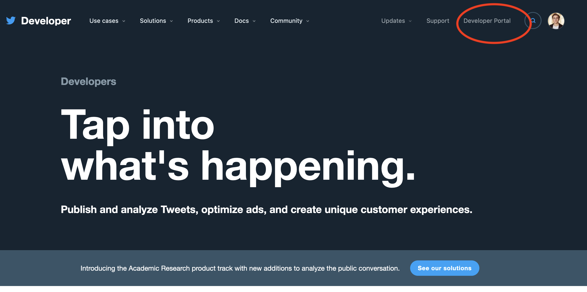
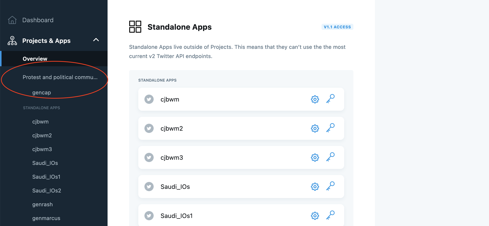
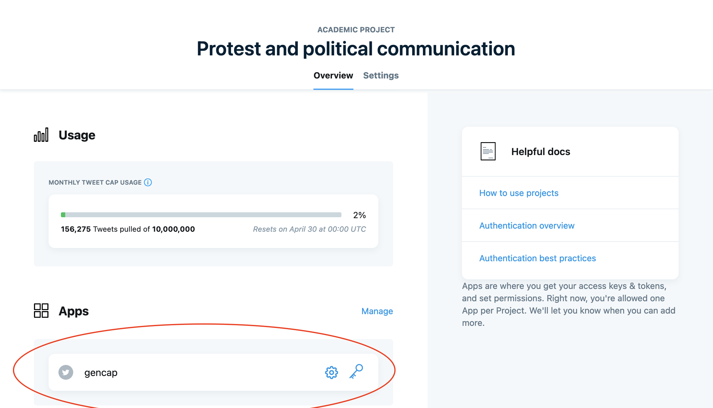
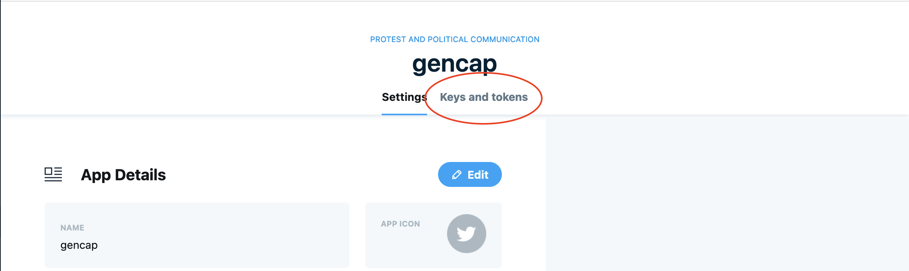
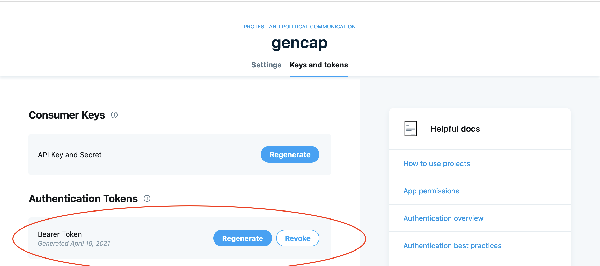

```{r, include = FALSE}
knitr::opts_chunk$set(
  collapse = TRUE,
  comment = "#>"
)
```

## Introduction

In order to use the Twitter Academic Research Product Track you will first need to obtain an authorization token. You will find details about the process of obtaining authorization [here](https://developer.twitter.com/en/solutions/academic-research/application-info). 

**In order to gain authorization you first need a Twitter account.**

First, Twitter will ask for details about your academic profile. Per the documentation linked above, they will ask for the following:

> Your full name as it is appears on your institution’s documentation
> 
>   Links to webpages that help establish your identity; provide one or more of the following:
> 
>   - A link to your profile in your institution’s faculty or student directory
>   - A link to your Google Scholar profile
>   - A link to your research group, lab or departmental website where you are listed
> 
>   Information about your academic institution: its name, country, state, and city
> 
>   Your department, school, or lab name
> 
>   Your academic field of study or discipline at this institution
> 
>   Your current role as an academic (whether you are a graduate student, doctoral candidate,       post-doc, professor, research scientist, or other faculty member)

Twitter will then ask for details of the proposed research project. Here, questions include:

> 1. What is the name of your research project?
>
> 2. Does this project receive funding from outside your academic institution? If yes, please list all your sources of funding.
>
> 3. In English, describe your research project. Minimum 200 characters.
>
> 4. In English, describe how Twitter data via the Twitter API will be used in your research project. Minimum 200 characters.
>
> 5. In English, describe your methodology for analyzing Twitter data, Tweets, and/or Twitter users. Minimum 200 characters.
>
> 6. Will your research present Twitter data individually or in aggregate?
>
> 7. In English, describe how you will share the outcomes of your research (include tools, data, and/or other resources you hope to build and share). Minimum 200 characters.
>
> 8. Will your analysis make Twitter content or derived information available to a government entity?

Once you have gained authorization for your project you will be able to see the new project on your Twitter developer portal. First click on the developer portal as below. 


<center>
{width=80%}
</center>


Here you will see your new project, and the name you gave it, appear on the left hand side. Once you have associated an App with this project, it will also appear below the name of the project. Here, I have several Apps authorized to query the basic API. I have one App, named "gencap", that is associated with my Academic Research Product Track project. 

<center>
{width=80%}
</center>

When you click on the project, you will first see how much of your monthly cap of 10m tweets you have spent. You will also see the App associated with your project below the monthly tweet cap usage information.

<center>
{width=80%}
</center>

By clicking on the Settings icons for the App, you will be taken through to the information about the App associated with the project. Here, you will see two options listed, for "Settings" and "Keys and Tokens."

<center>
{width=80%}
</center>

Beside the panel for Bearer Token, you will see an option to Regenerate the token. You can do this if you have not stored the information about the token and no longer have access to it. It is important to store information on the Bearer Token to avoid having to continually regenerate the Bearer Token information.

<center>
{width=80%}
</center>

Once you have the Bearer Token, you are ready to use `academictwitteR`!