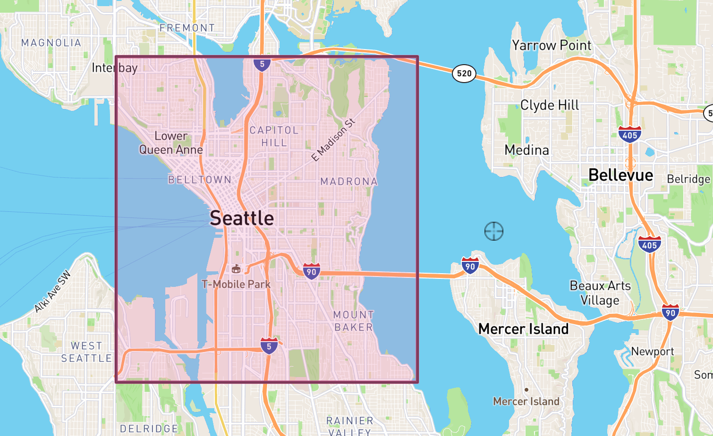

```{r, include = FALSE}
knitr::opts_chunk$set(
  collapse = TRUE,
  comment = "#>"
)
```

## Introduction

The v2 Twitter API allows for greater precision when making queries. A query might just be a single string like "happy new year" if you're interested on how people are celebrating on the night of December 31. Alternatively, the query might involve several additional operators that filter tweets with greater precision to return specific tweet content. 

This vignette guides you through the logics underpinning queries to the Twitter API. For full information on these logics you may additionally wish to consult the Twitter API documentation on how to build a query [here](https://developer.twitter.com/en/docs/twitter-api/tweets/search/integrate/build-a-query).

## Query strings

We first load our package into memory with:

```{r, eval =FALSE}
library(academictwitteR)
```

```{r, echo =FALSE}
library(devtools)
load_all()
```

We then make sure we have set our bearer token appropriately by calling:

```{r, eval =FALSE}
get_bearer()
```

```{r, echo =FALSE}
bearer_example <- "AAAAAAAAAAAAAAAAAAAAAPw%2BJQEAAAAAq5Ot8BBYyYlAqT9nLMuVuR1jI5fA%3DqG9HTHISISNOTAREALTOKEN"
bearer_example
```

If your bearer token is not set appropriately, consult the guide in [the authorization vignette](academictwitteR-auth.html).

Let's say we were interested in what people were talking about on New Year's Eve. We might do something like this:

```{r, eval = F}

tweets <-
  get_all_tweets(
    query = "happy",
    start_tweets = "2019-12-31T10:00:00Z",
    end_tweets = "2020-01-01T10:00:00Z",
    n = 10000
  )

```

Note here that we have also specified an upper limit of 10,000 tweets. The default is 100. For most applications, the user will need to specify a higher n than the default. 

The default upper limit is set to 100 in order to prevent unnecessary ingests of data when e.g. trialling an API call.

As an alternative to this, the user might also wish to use the `count_all_tweets()` function in order to get an idea of how many tweets match the specified API query.

## Additional parameters

In the above we search for all tweets between two dates that contain the string "happy." But what if we were only interested in a particular region or written in a particular language?

Let's say we were only interested in tweets written in English and originating from the US. We would add several operators to our query to filter by these characteristics:

```{r, eval = F}

tweets <-
  get_all_tweets(
    query = "happy",
    start_tweets = "2019-12-31T10:00:00Z",
    end_tweets = "2020-01-01T10:00:00Z",
    country = "US", 
    lang = "en"
  )

```

In fact, the `get_all_tweets()` function can be combined with multiple additional filtering parameters. The example below includes numerous additional filters, keeping only tweets with images, hashtags, and mentions:

```{r, eval = F}

tweets <-
  get_all_tweets(
    query = "happy",
    start_tweets = "2019-12-31T10:00:00Z",
    end_tweets = "2020-01-01T10:00:00Z",
    country = "US", 
    lang = "en",
    has_images = TRUE,
    has_hashtags = TRUE,
    has_mentions = TRUE
  )

```

We might then decide that our geo filter is not accurate enough. We don't just want tweets originating from the US but we want tweets from Seattle in particular. This would mean adding more operators to our query:

```{r, eval=F}
tweets <-
  get_all_tweets(
    query = "happy",
    start_tweets = "2019-12-31T10:00:00Z",
    end_tweets = "2020-01-01T10:00:00Z",
    country = "US", 
    place = "seattle",
    lang = "en",
    has_images = TRUE,
    has_hashtags = TRUE,
    has_mentions = TRUE
  )
  
```

What if we were unsatisfied with the accuracy of our geo parameters and we wanted to be sure that our tweets were actually coming from a particular place? Let's say we are interested in central Seattle, as shown in the map below.

{width=70%}

Twitter also allows us to query tweets originating from within a particular geographical buffer too. Here, we simply specify the longitude and latitude of the southwest and then the northeast corners of this bounding box. Note, this image is taken from a screenshot of the website [http://bboxfinder.com](http://bboxfinder.com). 

Many such websites exist that allow you to find the bounding box coordinates of a place of interest, including [https://www.openstreetmap.org](https://www.openstreetmap.org) and [https://boundingbox.klokantech.com/](https://boundingbox.klokantech.com/).

We can then input this information with the Twitter "bounding_box" operator using the `bbox` argument as below:


```{r, eval=F}

tweets <-
  get_all_tweets(
    query = "happy",
    start_tweets = "2019-12-31T10:00:00Z",
    end_tweets = "2020-01-01T10:00:00Z",
    country = "US", 
    place = "seattle",
    lang = "en",
    has_images = TRUE,
    has_hashtags = TRUE,
    has_mentions = TRUE,
    bbox = c(-122.375679, 47.563554, -122.266159, 47.643417)
  )
  
  
```

The alternative `point_radius` argument requires three pieces of information: the longitude and latitude of a target coordinate, and the buffer size around that coordinate.

```{r, eval=F}

tweets <-
  get_all_tweets(
    query = "happy",
    start_tweets = "2019-12-31T10:00:00Z",
    end_tweets = "2020-01-01T10:00:00Z",
    country = "US", 
    place = "seattle",
    lang = "en",
    point_radius = c(-122.33795253639994, 47.60900846404393, 25)
  )
  
```

Note that the maximum radius for the buffer is 25 miles. Similarly, the maximum height and width of any bounding box is 25 miles. Inputting coordinate information that exceeds these bounds will result in a 400 status code error.

## Multiple query strings

In the above we were specifying just one query string. If we were interested in multiple query strings, however, we could easily do this by just defining a character vector and passing this to the `get_all_tweets()` function as our query.

So let's say we wanted to search for tweets with the words "happy," "new" or "year" or any combination of these words within the same tweet. 

```{r, eval = F}

tweets <-
  get_all_tweets(
    query = c("happy", "new", "year"),
    start_tweets = "2019-12-31T10:00:00Z",
    end_tweets = "2020-01-01T10:00:00Z"
  )

```

The same is true for hashtags. We would just need to add the # before the string. So if we were interested in tweets containing #BLM or #BlackLivesMatter then we would do the following:

```{r, eval = F}

tweets <-
  get_all_tweets(
    query = c("#BLM", "#BlackLivesMatter"),
    start_tweets = "2019-12-31T10:00:00Z",
    end_tweets = "2020-01-01T10:00:00Z"
  )

```

This is the equivalent of the OR operator logics detailed by Twitter [here](https://developer.twitter.com/en/docs/twitter-api/tweets/search/integrate/build-a-query).

Note that the "AND" operator is implicit when specifying more than one character string in the query. Thus, when searching for all elements of a character string, a call may look like:

```{r, eval=F}

tweets <- get_all_tweets(
  query = c("twitter social"),
  users = c("cbarrie", "jack"),
  start_tweets = "2020-01-01T00:00:00Z",
  end_tweets = "2020-05-01T00:00:00Z",
  n = 1000
)

```

, which will capture tweets containing *both* the words "twitter" and "social." The same logics apply for hashtag queries.

Finally, we can search for *exact* phrases by using an additional optional parameter `exact_phrase`. So, if we wanted to search tweets containing, for example, the exact phrase "Black Lives Matter," we could do the following:

```{r, eval = F}

tweets <-
  get_all_tweets(
    query = "Black Lives Matter",
    exact_phrase = T,
    start_tweets = "2021-01-04T00:00:00Z",
    end_tweets = "2021-01-04T00:45:00Z",
    n = Inf
  )

```

## Checking your query

When building your query you can also check the query you are building separately with the `build_query()`, which is called inside the `get_all_tweets()` function. 

So, the above query focusing on Seattle is querying the following, which we can build separately as so:

```{r}

build_query(
  query = "happy",
  country = "US",
  place = "seattle",
  lang = "en",
  point_radius = c(-122.33795253639994, 47.60900846404393, 25)
)

```

Here we can see and check the format of the query sent to the Twitter API. 

## Getting user tweets

Finally, we can combine all of the above search functionality when searching by a set of users. To do this we simply need to specify the user or set of users as follows:

```{r, eval = F}

tweets <-
  get_all_tweets(
    users = c("cbarrie", "jack"),
    start_tweets = "2021-01-01T00:00:00Z",
    end_tweets = "2021-06-01T00:00:00Z",
    n = 1000
  )

```

Notice that here we are not specifying any string query. Instead, we are getting all the tweets by users @cbarrie and @jack over a given time period, collecting up to a limit of 1000 tweets.

However, we could also search user tweets and filter by what they're saying at the same time. Here, we would be getting tweets by users @cbarrie and @jack when they were talking about a shared love, "twitter":

```{r, eval = F}

get_all_tweets(
  query = "twitter",
  users = c("cbarrie", "jack"),
  start_tweets = "2021-01-01T00:00:00Z",
  end_tweets = "2021-06-01T00:00:00Z",
  n = 1000
)

```